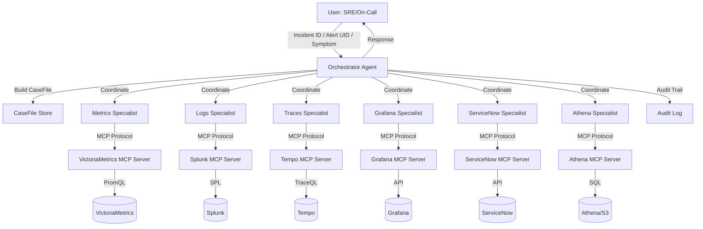
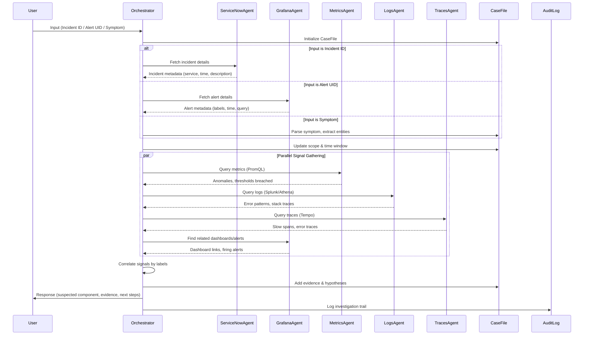

# Design Document: Observability Troubleshooting Copilot

## Overview

The Observability Troubleshooting Copilot is an AI-powered system that accelerates incident triage and root cause analysis by correlating signals across multiple observability platforms. Given an Incident ID (ServiceNow), Alert UID (Grafana), or free-form symptom description, the system automatically builds a comprehensive CaseFile containing scope, time windows, correlated signals, evidence, and actionable hypotheses. The copilot queries VictoriaMetrics (PromQL), Splunk, S3 Parquet (Athena), Tempo traces, Grafana dashboards/alerts, and ServiceNow incidents through standardized MCP (Model Context Protocol) servers, ensuring read-only access and mandatory evidence trails. The architecture follows an orchestrator-specialist pattern where a central orchestrator coordinates specialist agents (metrics, logs, traces, grafana, servicenow, athena) to gather and correlate data, ultimately producing a structured response with suspected components, firing alerts, relevant dashboards, executed queries, and safe next steps.

The system enforces strict guardrails: read-only operations by default, PII redaction in all outputs, and evidence-based assertions (every claim must reference a query result, trace ID, or dashboard link). When correlation by standard labels (service.name, env, cluster, namespace) is incomplete, the system explicitly identifies gaps and suggests standardization improvements.

## Architecture




## Main Workflow Sequence




## Components and Interfaces

### Component 1: Orchestrator Agent

**Purpose**: Central coordinator that receives user input, initializes CaseFile, delegates to specialist agents, correlates signals, and produces final response.

**Interface**:
```pascal
INTERFACE OrchestratorAgent
  PROCEDURE investigate(input: Input): Response
  PROCEDURE buildCaseFile(input: Input): CaseFile
  PROCEDURE coordinateSpecialists(caseFile: CaseFile): Evidence[]
  PROCEDURE correlateSignals(evidence: Evidence[]): Hypothesis[]
  PROCEDURE generateResponse(caseFile: CaseFile, hypotheses: Hypothesis[]): Response
END INTERFACE
```

**Responsibilities**:
- Parse and validate user input (Incident ID, Alert UID, or symptom)
- Initialize and maintain CaseFile throughout investigation
- Coordinate parallel queries to specialist agents
- Correlate signals across metrics, logs, traces, alerts using standard labels
- Identify correlation gaps and suggest label standardization
- Generate structured response with evidence and next steps
- Enforce read-only guardrails and PII redaction
- Log audit trail for every investigation

### Component 2: Metrics Specialist Agent

**Purpose**: Query VictoriaMetrics using PromQL to identify metric anomalies, threshold breaches, and resource saturation.

**Interface**:
```pascal
INTERFACE MetricsSpecialistAgent
  PROCEDURE queryMetrics(scope: Scope, timeWindow: TimeWindow): MetricEvidence[]
  PROCEDURE detectAnomalies(metrics: MetricEvidence[]): Anomaly[]
  PROCEDURE findRelatedMetrics(labels: Labels): MetricEvidence[]
END INTERFACE
```

**Responsibilities**:
- Execute PromQL queries via VictoriaMetrics MCP server
- Detect anomalies (spikes, drops, threshold breaches)
- Identify resource saturation (CPU, memory, disk, network)
- Return metric evidence with query, result, and timestamp
- Correlate metrics by service.name, env, cluster, namespace labels


### Component 3: Logs Specialist Agent

**Purpose**: Query Splunk and Athena (S3 Parquet) to find error patterns, stack traces, and log anomalies.

**Interface**:
```pascal
INTERFACE LogsSpecialistAgent
  PROCEDURE querySplunk(scope: Scope, timeWindow: TimeWindow): LogEvidence[]
  PROCEDURE queryAthena(scope: Scope, timeWindow: TimeWindow): LogEvidence[]
  PROCEDURE extractErrorPatterns(logs: LogEvidence[]): ErrorPattern[]
  PROCEDURE findStackTraces(logs: LogEvidence[]): StackTrace[]
END INTERFACE
```

**Responsibilities**:
- Execute SPL queries via Splunk MCP server
- Execute SQL queries via Athena MCP server (S3 Parquet forensics)
- Extract error patterns and signatures
- Identify stack traces and exception types
- Return log evidence with query, result, and redacted PII
- Correlate logs by service.name, pod, namespace labels

### Component 4: Traces Specialist Agent

**Purpose**: Query Tempo using TraceQL to identify slow spans, error traces, and service dependencies.

**Interface**:
```pascal
INTERFACE TracesSpecialistAgent
  PROCEDURE queryTraces(scope: Scope, timeWindow: TimeWindow): TraceEvidence[]
  PROCEDURE findSlowSpans(traces: TraceEvidence[]): SlowSpan[]
  PROCEDURE findErrorTraces(traces: TraceEvidence[]): ErrorTrace[]
  PROCEDURE buildServiceDependencyGraph(traces: TraceEvidence[]): DependencyGraph
END INTERFACE
```

**Responsibilities**:
- Execute TraceQL queries via Tempo MCP server
- Identify slow spans (latency anomalies)
- Find error traces and failure points
- Build service dependency graph from trace data
- Return trace evidence with trace_id, span_id, and links
- Correlate traces by service.name, trace_id labels


### Component 5: Grafana Specialist Agent

**Purpose**: Query Grafana API to fetch alert details, find related dashboards, and retrieve panel links.

**Interface**:
```pascal
INTERFACE GrafanaSpecialistAgent
  PROCEDURE fetchAlertDetails(alertUID: String): AlertDetails
  PROCEDURE findFiringAlerts(scope: Scope): Alert[]
  PROCEDURE findRelatedDashboards(labels: Labels): Dashboard[]
  PROCEDURE getPanelLinks(dashboard: Dashboard, labels: Labels): PanelLink[]
END INTERFACE
```

**Responsibilities**:
- Fetch alert details by UID via Grafana MCP server
- Find currently firing alerts matching scope
- Discover related dashboards by labels
- Generate direct links to relevant panels
- Return alert/dashboard evidence with UIDs and URLs
- Correlate by service.name, env, cluster labels

### Component 6: ServiceNow Specialist Agent

**Purpose**: Query ServiceNow API to fetch incident details, related incidents, and change history.

**Interface**:
```pascal
INTERFACE ServiceNowSpecialistAgent
  PROCEDURE fetchIncidentDetails(incidentID: String): IncidentDetails
  PROCEDURE findRelatedIncidents(scope: Scope, timeWindow: TimeWindow): Incident[]
  PROCEDURE getRecentChanges(scope: Scope, timeWindow: TimeWindow): Change[]
END INTERFACE
```

**Responsibilities**:
- Fetch incident details by ID via ServiceNow MCP server
- Find related incidents in same service/component
- Retrieve recent changes (deployments, config changes)
- Return incident evidence with incident numbers and links
- Correlate by service, configuration item (CI), assignment group

### Component 7: Athena Specialist Agent

**Purpose**: Query S3 Parquet logs via Athena for forensic analysis and historical pattern matching.

**Interface**:
```pascal
INTERFACE AthenaSpecialistAgent
  PROCEDURE queryParquetLogs(scope: Scope, timeWindow: TimeWindow): LogEvidence[]
  PROCEDURE findHistoricalPatterns(errorSignature: String): HistoricalPattern[]
  PROCEDURE aggregateErrorCounts(scope: Scope, timeWindow: TimeWindow): ErrorAggregate[]
END INTERFACE
```

**Responsibilities**:
- Execute SQL queries via Athena MCP server on S3 Parquet data
- Perform forensic analysis on historical logs
- Find similar error patterns from past incidents
- Aggregate error counts and trends
- Return log evidence with query execution ID and S3 paths
- Correlate by service.name, pod, namespace labels


## Data Models

### Model 1: CaseFile

```pascal
STRUCTURE CaseFile
  id: UUID
  createdAt: Timestamp
  updatedAt: Timestamp
  input: Input
  scope: Scope
  timeWindow: TimeWindow
  signals: Signal[]
  evidence: Evidence[]
  hypotheses: Hypothesis[]
  correlationGaps: CorrelationGap[]
  auditTrail: AuditEntry[]
END STRUCTURE
```

**Validation Rules**:
- id must be unique UUID
- timeWindow.start must be before timeWindow.end
- All evidence must have source reference (query/traceId/link)
- All hypotheses must reference at least one evidence item
- PII must be redacted in all text fields

### Model 2: Input

```pascal
STRUCTURE Input
  type: InputType  // INCIDENT_ID | ALERT_UID | SYMPTOM
  value: String
  timestamp: Timestamp
  user: String
END STRUCTURE

ENUMERATION InputType
  INCIDENT_ID
  ALERT_UID
  SYMPTOM
END ENUMERATION
```

**Validation Rules**:
- type must be one of the defined InputType values
- value must be non-empty string
- For INCIDENT_ID: value must match ServiceNow incident format (e.g., INC0012345)
- For ALERT_UID: value must be valid Grafana alert UID format

### Model 3: Scope

```pascal
STRUCTURE Scope
  serviceName: String
  environment: String
  cluster: String
  namespace: String
  pod: String
  deployment: String
  additionalLabels: Map<String, String>
END STRUCTURE
```

**Validation Rules**:
- At least one field must be non-empty
- serviceName is preferred for correlation
- All fields follow standard label naming conventions


### Model 4: TimeWindow

```pascal
STRUCTURE TimeWindow
  start: Timestamp
  end: Timestamp
  duration: Duration
END STRUCTURE
```

**Validation Rules**:
- start must be before end
- duration must equal (end - start)
- Maximum window size: 7 days (configurable)

### Model 5: Evidence

```pascal
STRUCTURE Evidence
  id: UUID
  type: EvidenceType
  source: String  // MCP server name
  query: String
  result: JSON
  timestamp: Timestamp
  links: String[]
  confidence: Float  // 0.0 to 1.0
  redacted: Boolean
END STRUCTURE

ENUMERATION EvidenceType
  METRIC_ANOMALY
  LOG_ERROR
  TRACE_SLOW_SPAN
  TRACE_ERROR
  ALERT_FIRING
  DASHBOARD_PANEL
  INCIDENT_RELATED
  CHANGE_RECENT
END ENUMERATION
```

**Validation Rules**:
- query must be non-empty for all types except INCIDENT_RELATED
- result must be valid JSON
- confidence must be between 0.0 and 1.0
- links must contain valid URLs
- If redacted is true, result must not contain PII patterns

### Model 6: Hypothesis

```pascal
STRUCTURE Hypothesis
  id: UUID
  description: String
  suspectedComponent: String
  rootCause: String
  evidenceIds: UUID[]
  confidence: Float  // 0.0 to 1.0
  nextSteps: NextStep[]
END STRUCTURE
```

**Validation Rules**:
- description must be non-empty
- evidenceIds must reference existing Evidence items
- confidence must be between 0.0 and 1.0
- At least one nextStep must be provided


### Model 7: NextStep

```pascal
STRUCTURE NextStep
  action: String
  description: String
  query: String
  link: String
  readOnly: Boolean
  priority: Priority
END STRUCTURE

ENUMERATION Priority
  HIGH
  MEDIUM
  LOW
END ENUMERATION
```

**Validation Rules**:
- action must be non-empty
- readOnly must be true (write operations not allowed in PoC)
- At least one of query or link must be provided

### Model 8: CorrelationGap

```pascal
STRUCTURE CorrelationGap
  missingLabel: String
  affectedSources: String[]
  impact: String
  recommendation: String
END STRUCTURE
```

**Validation Rules**:
- missingLabel must be one of standard labels (service.name, env, cluster, namespace)
- affectedSources must list MCP servers with incomplete labels
- recommendation must suggest standardization approach

### Model 9: MCP Tool Contract

```pascal
STRUCTURE MCPToolRequest
  tool: String
  parameters: Map<String, Any>
  timeout: Duration
END STRUCTURE

STRUCTURE MCPToolResponse
  success: Boolean
  result: JSON
  error: String
  executionTime: Duration
  metadata: Map<String, String>
END STRUCTURE
```

**Validation Rules**:
- tool must be registered MCP tool name
- timeout must be positive duration
- If success is false, error must be non-empty
- metadata must include source MCP server name


## Algorithmic Pseudocode

### Main Investigation Algorithm

```pascal
ALGORITHM investigateIncident(input)
INPUT: input of type Input
OUTPUT: response of type Response

BEGIN
  ASSERT validateInput(input) = true
  
  // Step 1: Initialize CaseFile
  caseFile ← createCaseFile(input)
  auditLog("Investigation started", input)
  
  // Step 2: Determine scope and time window
  IF input.type = INCIDENT_ID THEN
    incidentDetails ← serviceNowAgent.fetchIncidentDetails(input.value)
    caseFile.scope ← extractScope(incidentDetails)
    caseFile.timeWindow ← extractTimeWindow(incidentDetails)
  ELSE IF input.type = ALERT_UID THEN
    alertDetails ← grafanaAgent.fetchAlertDetails(input.value)
    caseFile.scope ← extractScope(alertDetails)
    caseFile.timeWindow ← extractTimeWindow(alertDetails)
  ELSE
    caseFile.scope ← parseSymptomForScope(input.value)
    caseFile.timeWindow ← defaultTimeWindow()
  END IF
  
  // Step 3: Parallel signal gathering
  evidenceList ← EMPTY_LIST
  
  PARALLEL_EXECUTE
    metricsEvidence ← metricsAgent.queryMetrics(caseFile.scope, caseFile.timeWindow)
    logsEvidence ← logsAgent.querySplunk(caseFile.scope, caseFile.timeWindow)
    athenaEvidence ← athenaAgent.queryParquetLogs(caseFile.scope, caseFile.timeWindow)
    tracesEvidence ← tracesAgent.queryTraces(caseFile.scope, caseFile.timeWindow)
    alertsEvidence ← grafanaAgent.findFiringAlerts(caseFile.scope)
    dashboardsEvidence ← grafanaAgent.findRelatedDashboards(caseFile.scope.labels)
  END PARALLEL_EXECUTE
  
  evidenceList.addAll(metricsEvidence, logsEvidence, athenaEvidence, 
                      tracesEvidence, alertsEvidence, dashboardsEvidence)
  
  // Step 4: Correlate signals
  correlationResult ← correlateSignals(evidenceList, caseFile.scope)
  caseFile.evidence ← correlationResult.evidence
  caseFile.correlationGaps ← correlationResult.gaps
  
  // Step 5: Generate hypotheses
  hypotheses ← generateHypotheses(caseFile.evidence)
  caseFile.hypotheses ← rankHypothesesByConfidence(hypotheses)
  
  // Step 6: Build response
  response ← buildResponse(caseFile)
  
  // Step 7: Audit trail
  auditLog("Investigation completed", caseFile)
  
  RETURN response
END
```

**Preconditions:**
- input is validated and well-formed
- All MCP servers are accessible and authenticated
- CaseFile storage is available

**Postconditions:**
- Returns valid Response object with evidence
- CaseFile is persisted with complete audit trail
- All PII is redacted from response
- All evidence has source references

**Loop Invariants:** N/A (parallel execution, no loops in main flow)


### Signal Correlation Algorithm

```pascal
ALGORITHM correlateSignals(evidenceList, scope)
INPUT: evidenceList of type Evidence[], scope of type Scope
OUTPUT: correlationResult of type CorrelationResult

BEGIN
  correlatedEvidence ← EMPTY_LIST
  gaps ← EMPTY_LIST
  
  // Standard correlation labels
  standardLabels ← ["service.name", "env", "cluster", "namespace", "pod", "trace_id"]
  
  // Group evidence by correlation keys
  evidenceGroups ← MAP<String, Evidence[]>
  
  FOR each evidence IN evidenceList DO
    correlationKey ← extractCorrelationKey(evidence, standardLabels)
    
    IF correlationKey IS NOT NULL THEN
      evidenceGroups[correlationKey].add(evidence)
    ELSE
      // Track correlation gap
      missingLabels ← findMissingLabels(evidence, standardLabels)
      gap ← createCorrelationGap(missingLabels, evidence.source)
      gaps.add(gap)
    END IF
  END FOR
  
  // Correlate within groups
  FOR each key, group IN evidenceGroups DO
    IF group.size >= 2 THEN
      // Multiple signals correlated - high confidence
      FOR each evidence IN group DO
        evidence.confidence ← evidence.confidence * 1.2
        correlatedEvidence.add(evidence)
      END FOR
    ELSE
      // Single signal - lower confidence
      evidence ← group[0]
      evidence.confidence ← evidence.confidence * 0.8
      correlatedEvidence.add(evidence)
    END IF
  END FOR
  
  RETURN CorrelationResult(correlatedEvidence, gaps)
END
```

**Preconditions:**
- evidenceList is non-empty
- scope contains at least one label
- standardLabels list is defined

**Postconditions:**
- Returns CorrelationResult with correlated evidence
- Evidence confidence scores are adjusted based on correlation
- Correlation gaps are identified and documented
- All evidence items are processed

**Loop Invariants:**
- All processed evidence maintains valid confidence scores (0.0 to 1.0)
- Correlation keys are unique within evidenceGroups map
- Gap tracking remains consistent throughout iteration


### Hypothesis Generation Algorithm

```pascal
ALGORITHM generateHypotheses(evidenceList)
INPUT: evidenceList of type Evidence[]
OUTPUT: hypotheses of type Hypothesis[]

BEGIN
  hypotheses ← EMPTY_LIST
  
  // Group evidence by suspected component
  componentGroups ← groupByComponent(evidenceList)
  
  FOR each component, evidenceGroup IN componentGroups DO
    hypothesis ← EMPTY_HYPOTHESIS
    hypothesis.suspectedComponent ← component
    hypothesis.evidenceIds ← extractIds(evidenceGroup)
    
    // Analyze evidence types
    hasMetricAnomaly ← containsType(evidenceGroup, METRIC_ANOMALY)
    hasLogError ← containsType(evidenceGroup, LOG_ERROR)
    hasTraceError ← containsType(evidenceGroup, TRACE_ERROR)
    hasSlowSpan ← containsType(evidenceGroup, TRACE_SLOW_SPAN)
    hasFiringAlert ← containsType(evidenceGroup, ALERT_FIRING)
    
    // Pattern matching for root cause
    IF hasMetricAnomaly AND hasLogError AND hasTraceError THEN
      hypothesis.rootCause ← "Service failure with resource exhaustion"
      hypothesis.confidence ← 0.9
    ELSE IF hasSlowSpan AND hasMetricAnomaly THEN
      hypothesis.rootCause ← "Performance degradation"
      hypothesis.confidence ← 0.8
    ELSE IF hasLogError AND hasTraceError THEN
      hypothesis.rootCause ← "Application error or exception"
      hypothesis.confidence ← 0.75
    ELSE IF hasFiringAlert THEN
      hypothesis.rootCause ← "Threshold breach detected"
      hypothesis.confidence ← 0.7
    ELSE
      hypothesis.rootCause ← "Anomaly detected, further investigation needed"
      hypothesis.confidence ← 0.5
    END IF
    
    // Generate next steps
    hypothesis.nextSteps ← generateNextSteps(evidenceGroup, hypothesis.rootCause)
    hypothesis.description ← buildDescription(hypothesis)
    
    hypotheses.add(hypothesis)
  END FOR
  
  RETURN hypotheses
END
```

**Preconditions:**
- evidenceList is non-empty
- All evidence items have valid type and component information
- Evidence confidence scores are between 0.0 and 1.0

**Postconditions:**
- Returns list of hypotheses with confidence scores
- Each hypothesis references at least one evidence item
- Confidence scores are between 0.0 and 1.0
- All hypotheses have at least one next step

**Loop Invariants:**
- All generated hypotheses have valid confidence scores
- Evidence IDs in hypotheses reference existing evidence items
- Component grouping remains consistent throughout iteration


### PII Redaction Algorithm

```pascal
ALGORITHM redactPII(text)
INPUT: text of type String
OUTPUT: redactedText of type String

BEGIN
  redactedText ← text
  
  // PII patterns to detect and redact
  patterns ← [
    EMAIL_PATTERN,      // email@example.com
    PHONE_PATTERN,      // phone numbers
    IP_ADDRESS_PATTERN, // IP addresses (optional, context-dependent)
    SSN_PATTERN,        // social security numbers
    CREDIT_CARD_PATTERN,// credit card numbers
    API_KEY_PATTERN,    // API keys and tokens
    PASSWORD_PATTERN    // password fields
  ]
  
  FOR each pattern IN patterns DO
    matches ← findMatches(redactedText, pattern)
    
    FOR each match IN matches DO
      replacement ← generateReplacement(match, pattern)
      redactedText ← replace(redactedText, match, replacement)
    END FOR
  END FOR
  
  RETURN redactedText
END

FUNCTION generateReplacement(match, pattern)
INPUT: match of type String, pattern of type Pattern
OUTPUT: replacement of type String

BEGIN
  IF pattern = EMAIL_PATTERN THEN
    RETURN "[EMAIL_REDACTED]"
  ELSE IF pattern = PHONE_PATTERN THEN
    RETURN "[PHONE_REDACTED]"
  ELSE IF pattern = IP_ADDRESS_PATTERN THEN
    RETURN "[IP_REDACTED]"
  ELSE IF pattern = API_KEY_PATTERN THEN
    RETURN "[API_KEY_REDACTED]"
  ELSE
    RETURN "[PII_REDACTED]"
  END IF
END
```

**Preconditions:**
- text is a valid string (may be empty)
- patterns are valid regex patterns

**Postconditions:**
- Returns string with all PII patterns replaced
- Original text structure is preserved (length may change)
- No PII patterns remain in output

**Loop Invariants:**
- All previously processed patterns are redacted
- Text remains valid string throughout iteration


## MCP Tool Contracts

### VictoriaMetrics MCP Server

**Tool: query_metrics**

```pascal
INPUT:
  query: String          // PromQL query
  start: Timestamp       // Query start time
  end: Timestamp         // Query end time
  step: Duration         // Query resolution step

OUTPUT:
  success: Boolean
  result: MetricResult[] // Time series data
  query: String          // Executed query (for audit)
  executionTime: Duration
```

**Example Query:**
```promql
rate(http_requests_total{service="api-gateway", env="production"}[5m])
```

### Splunk MCP Server

**Tool: search_logs**

```pascal
INPUT:
  query: String          // SPL query
  earliest: Timestamp    // Search start time
  latest: Timestamp      // Search end time
  maxResults: Integer    // Maximum results to return

OUTPUT:
  success: Boolean
  result: LogEntry[]     // Log entries
  query: String          // Executed query (for audit)
  executionTime: Duration
```

**Example Query:**
```spl
index=app_logs service="api-gateway" level=ERROR earliest=-1h
| stats count by error_type
```

### Tempo MCP Server

**Tool: query_traces**

```pascal
INPUT:
  query: String          // TraceQL query
  start: Timestamp       // Query start time
  end: Timestamp         // Query end time
  limit: Integer         // Maximum traces to return

OUTPUT:
  success: Boolean
  result: Trace[]        // Trace data with spans
  query: String          // Executed query (for audit)
  executionTime: Duration
```

**Example Query:**
```traceql
{service.name="api-gateway" && status=error}
```


### Grafana MCP Server

**Tool: get_alert_details**

```pascal
INPUT:
  alertUID: String       // Grafana alert UID

OUTPUT:
  success: Boolean
  result: AlertDetails   // Alert metadata, labels, query, state
  alertURL: String       // Direct link to alert
  executionTime: Duration
```

**Tool: find_firing_alerts**

```pascal
INPUT:
  labels: Map<String, String>  // Filter labels
  dashboardUID: String         // Optional dashboard filter

OUTPUT:
  success: Boolean
  result: Alert[]              // Currently firing alerts
  executionTime: Duration
```

**Tool: find_dashboards**

```pascal
INPUT:
  labels: Map<String, String>  // Filter labels
  tags: String[]               // Dashboard tags

OUTPUT:
  success: Boolean
  result: Dashboard[]          // Matching dashboards
  executionTime: Duration
```

**Tool: get_panel_link**

```pascal
INPUT:
  dashboardUID: String   // Dashboard UID
  panelId: Integer       // Panel ID
  timeRange: TimeWindow  // Time range for link

OUTPUT:
  success: Boolean
  panelURL: String       // Direct link to panel with time range
  executionTime: Duration
```

### ServiceNow MCP Server

**Tool: get_incident**

```pascal
INPUT:
  incidentNumber: String // Incident ID (e.g., INC0012345)

OUTPUT:
  success: Boolean
  result: IncidentDetails // Incident metadata, description, CI, assignment
  incidentURL: String     // Direct link to incident
  executionTime: Duration
```

**Tool: find_related_incidents**

```pascal
INPUT:
  configurationItem: String  // CI name or ID
  timeWindow: TimeWindow     // Search time range
  state: String              // Optional state filter

OUTPUT:
  success: Boolean
  result: Incident[]         // Related incidents
  executionTime: Duration
```

**Tool: get_recent_changes**

```pascal
INPUT:
  configurationItem: String  // CI name or ID
  timeWindow: TimeWindow     // Search time range

OUTPUT:
  success: Boolean
  result: Change[]           // Recent changes (deployments, config)
  executionTime: Duration
```


### Athena MCP Server

**Tool: query_parquet_logs**

```pascal
INPUT:
  query: String          // SQL query for Parquet data
  database: String       // Athena database name
  workgroup: String      // Athena workgroup
  outputLocation: String // S3 output location

OUTPUT:
  success: Boolean
  result: LogEntry[]     // Query results
  query: String          // Executed query (for audit)
  queryExecutionId: String // Athena query execution ID
  executionTime: Duration
```

**Example Query:**
```sql
SELECT timestamp, service_name, level, message, trace_id
FROM logs_parquet
WHERE service_name = 'api-gateway'
  AND level = 'ERROR'
  AND timestamp BETWEEN '2024-01-01 00:00:00' AND '2024-01-01 01:00:00'
ORDER BY timestamp DESC
LIMIT 1000
```

**Tool: get_error_aggregates**

```pascal
INPUT:
  serviceName: String    // Service to analyze
  timeWindow: TimeWindow // Analysis time range
  groupBy: String[]      // Aggregation dimensions

OUTPUT:
  success: Boolean
  result: ErrorAggregate[] // Aggregated error counts
  executionTime: Duration
```

## Correlation Strategy

### Label-Based Correlation

The system uses standard OpenTelemetry semantic conventions and Kubernetes labels for correlation:

**Primary Correlation Keys:**
- `service.name` - Service identifier (highest priority)
- `env` or `environment` - Environment (production, staging, etc.)
- `cluster` - Kubernetes cluster name
- `namespace` - Kubernetes namespace
- `pod` - Pod name
- `deployment` - Deployment name
- `trace_id` - Distributed trace ID

**Correlation Algorithm:**

```pascal
FUNCTION extractCorrelationKey(evidence, standardLabels)
INPUT: evidence of type Evidence, standardLabels of type String[]
OUTPUT: correlationKey of type String or NULL

BEGIN
  labels ← extractLabels(evidence.result)
  keyParts ← EMPTY_LIST
  
  FOR each label IN standardLabels DO
    IF labels.contains(label) THEN
      keyParts.add(label + "=" + labels[label])
    END IF
  END FOR
  
  IF keyParts.isEmpty THEN
    RETURN NULL
  ELSE
    RETURN join(keyParts, "|")
  END IF
END
```


### Fallback Strategies When Labels Are Missing

**Strategy 1: Time-Based Correlation**
- When labels are incomplete, correlate signals by temporal proximity
- Events within same 5-minute window are considered potentially related
- Lower confidence score applied

**Strategy 2: Pattern Matching**
- Match error signatures across logs and traces
- Correlate metric anomalies with log error spikes by timestamp
- Use service name extraction from log messages when label missing

**Strategy 3: Explicit Gap Reporting**
```pascal
FUNCTION createCorrelationGap(missingLabels, source)
INPUT: missingLabels of type String[], source of type String
OUTPUT: gap of type CorrelationGap

BEGIN
  gap ← EMPTY_CORRELATION_GAP
  gap.missingLabel ← missingLabels[0]  // Primary missing label
  gap.affectedSources ← [source]
  gap.impact ← "Reduced correlation accuracy for " + source
  gap.recommendation ← "Add " + missingLabels[0] + " label to " + source + " telemetry"
  
  RETURN gap
END
```

**Strategy 4: User Notification**
- Include correlation gaps in response
- Provide specific recommendations for label standardization
- Link to documentation on OpenTelemetry semantic conventions

## Example Usage

### Example 1: Investigation by Incident ID

```pascal
SEQUENCE
  input ← Input(type: INCIDENT_ID, value: "INC0012345")
  response ← orchestrator.investigate(input)
  
  DISPLAY "Suspected Component: " + response.hypotheses[0].suspectedComponent
  DISPLAY "Root Cause: " + response.hypotheses[0].rootCause
  DISPLAY "Confidence: " + response.hypotheses[0].confidence
  
  FOR each evidence IN response.evidence DO
    DISPLAY "Evidence: " + evidence.type
    DISPLAY "Query: " + evidence.query
    DISPLAY "Link: " + evidence.links[0]
  END FOR
  
  FOR each step IN response.hypotheses[0].nextSteps DO
    DISPLAY "Next Step: " + step.action
    DISPLAY "Query: " + step.query
  END FOR
END SEQUENCE
```

### Example 2: Investigation by Alert UID

```pascal
SEQUENCE
  input ← Input(type: ALERT_UID, value: "abc123def456")
  response ← orchestrator.investigate(input)
  
  IF response.correlationGaps.isNotEmpty THEN
    DISPLAY "Warning: Correlation gaps detected"
    FOR each gap IN response.correlationGaps DO
      DISPLAY "Missing: " + gap.missingLabel
      DISPLAY "Recommendation: " + gap.recommendation
    END FOR
  END IF
  
  DISPLAY "Top Hypothesis: " + response.hypotheses[0].description
  DISPLAY "Evidence Count: " + response.evidence.length
END SEQUENCE
```


### Example 3: Investigation by Symptom

```pascal
SEQUENCE
  input ← Input(type: SYMPTOM, value: "API Gateway returning 500 errors in production")
  response ← orchestrator.investigate(input)
  
  caseFile ← response.caseFile
  DISPLAY "Scope: " + caseFile.scope.serviceName
  DISPLAY "Time Window: " + caseFile.timeWindow.start + " to " + caseFile.timeWindow.end
  
  FOR each hypothesis IN response.hypotheses DO
    DISPLAY "Hypothesis " + hypothesis.id
    DISPLAY "  Component: " + hypothesis.suspectedComponent
    DISPLAY "  Root Cause: " + hypothesis.rootCause
    DISPLAY "  Confidence: " + hypothesis.confidence
    DISPLAY "  Evidence Count: " + hypothesis.evidenceIds.length
  END FOR
END SEQUENCE
```

## Key Functions with Formal Specifications

### Function 1: validateInput()

```pascal
FUNCTION validateInput(input)
INPUT: input of type Input
OUTPUT: isValid of type Boolean
```

**Preconditions:**
- input parameter is provided (not null)

**Postconditions:**
- Returns true if and only if input is valid
- For INCIDENT_ID: value matches ServiceNow format (INC followed by digits)
- For ALERT_UID: value is non-empty string
- For SYMPTOM: value is non-empty string
- No side effects on input parameter

**Loop Invariants:** N/A (no loops)

### Function 2: extractScope()

```pascal
FUNCTION extractScope(metadata)
INPUT: metadata of type JSON (from incident or alert)
OUTPUT: scope of type Scope
```

**Preconditions:**
- metadata is valid JSON object
- metadata contains at least one identifiable field

**Postconditions:**
- Returns Scope object with extracted labels
- At least one scope field is non-empty
- Labels follow standard naming conventions
- No PII in scope fields

**Loop Invariants:** N/A (no loops)

### Function 3: redactPII()

```pascal
FUNCTION redactPII(text)
INPUT: text of type String
OUTPUT: redactedText of type String
```

**Preconditions:**
- text is valid string (may be empty)

**Postconditions:**
- Returns string with all PII patterns replaced
- No email addresses, phone numbers, API keys remain
- Original text structure preserved
- Redaction markers are clearly identifiable

**Loop Invariants:**
- All previously matched patterns are redacted
- Text remains valid string throughout iteration


### Function 4: rankHypothesesByConfidence()

```pascal
FUNCTION rankHypothesesByConfidence(hypotheses)
INPUT: hypotheses of type Hypothesis[]
OUTPUT: rankedHypotheses of type Hypothesis[]
```

**Preconditions:**
- hypotheses is non-empty array
- All hypotheses have valid confidence scores (0.0 to 1.0)

**Postconditions:**
- Returns sorted array in descending order by confidence
- All input hypotheses are present in output
- Highest confidence hypothesis is first
- Original hypotheses array is not modified

**Loop Invariants:**
- Sorted portion maintains descending confidence order
- All hypotheses maintain valid confidence scores

## Correctness Properties

### Property 1: Evidence Traceability
```pascal
PROPERTY EvidenceTraceability
  FORALL response IN Response:
    FORALL hypothesis IN response.hypotheses:
      FORALL evidenceId IN hypothesis.evidenceIds:
        EXISTS evidence IN response.evidence:
          evidence.id = evidenceId AND
          (evidence.query IS NOT NULL OR evidence.links IS NOT EMPTY)
```

**Description:** Every hypothesis must reference evidence that has either a query or link for traceability.

### Property 2: PII Redaction
```pascal
PROPERTY PIIRedaction
  FORALL response IN Response:
    FORALL evidence IN response.evidence:
      NOT containsPII(evidence.result) AND
      evidence.redacted = true IF originalContainedPII(evidence)
```

**Description:** All evidence results must be free of PII, and redaction flag must be set if PII was present.

### Property 3: Read-Only Operations
```pascal
PROPERTY ReadOnlyOperations
  FORALL nextStep IN NextStep:
    nextStep.readOnly = true AND
    NOT isMutationOperation(nextStep.action)
```

**Description:** All next steps must be read-only operations; no mutations allowed.

### Property 4: Time Window Validity
```pascal
PROPERTY TimeWindowValidity
  FORALL caseFile IN CaseFile:
    caseFile.timeWindow.start < caseFile.timeWindow.end AND
    caseFile.timeWindow.duration = (caseFile.timeWindow.end - caseFile.timeWindow.start) AND
    caseFile.timeWindow.duration <= MAX_WINDOW_SIZE
```

**Description:** Time windows must be valid (start before end) and within maximum allowed size.

### Property 5: Confidence Score Bounds
```pascal
PROPERTY ConfidenceScoreBounds
  FORALL evidence IN Evidence:
    0.0 <= evidence.confidence <= 1.0
  AND
  FORALL hypothesis IN Hypothesis:
    0.0 <= hypothesis.confidence <= 1.0
```

**Description:** All confidence scores must be within valid range [0.0, 1.0].


### Property 6: Correlation Gap Reporting
```pascal
PROPERTY CorrelationGapReporting
  FORALL evidence IN Evidence:
    IF NOT hasStandardLabels(evidence) THEN
      EXISTS gap IN CorrelationGap:
        gap.affectedSources CONTAINS evidence.source AND
        gap.recommendation IS NOT NULL
```

**Description:** When evidence lacks standard labels, a correlation gap must be reported with recommendations.

### Property 7: Audit Trail Completeness
```pascal
PROPERTY AuditTrailCompleteness
  FORALL investigation IN Investigation:
    EXISTS auditEntry IN AuditLog:
      auditEntry.action = "Investigation started" AND
      auditEntry.input = investigation.input
    AND
    EXISTS auditEntry IN AuditLog:
      auditEntry.action = "Investigation completed" AND
      auditEntry.caseFileId = investigation.caseFile.id
```

**Description:** Every investigation must have start and completion audit entries.

## Error Handling

### Error Scenario 1: MCP Server Unavailable

**Condition:** MCP server (VictoriaMetrics, Splunk, Tempo, etc.) is unreachable or returns error
**Response:** 
- Log error with server name and error details
- Continue investigation with available servers
- Mark affected evidence as "unavailable"
- Include server availability in response metadata
**Recovery:**
- Retry with exponential backoff (max 3 attempts)
- If all retries fail, proceed without that data source
- Notify user of incomplete investigation

### Error Scenario 2: Invalid Input Format

**Condition:** User provides malformed Incident ID, Alert UID, or empty symptom
**Response:**
- Validate input before processing
- Return error response with specific validation message
- Suggest correct format with examples
**Recovery:**
- Prompt user to provide valid input
- No CaseFile created for invalid input

### Error Scenario 3: No Evidence Found

**Condition:** All queries return empty results (no metrics, logs, traces found)
**Response:**
- Create CaseFile with empty evidence list
- Generate hypothesis: "No signals found in specified time window"
- Suggest expanding time window or checking scope
**Recovery:**
- Recommend verifying service name and labels
- Suggest checking if telemetry is being collected


### Error Scenario 4: Query Timeout

**Condition:** MCP server query exceeds timeout threshold
**Response:**
- Cancel query after timeout
- Log timeout event with query details
- Mark evidence as "timeout"
- Continue with other queries
**Recovery:**
- Suggest narrowing time window or scope
- Recommend optimizing query if possible
- Include timeout information in response

### Error Scenario 5: PII Detection Failure

**Condition:** PII redaction algorithm fails or encounters unexpected pattern
**Response:**
- Fail-safe: redact entire field if PII detection uncertain
- Log redaction failure for review
- Mark evidence as "heavily redacted"
**Recovery:**
- Manual review of redaction patterns
- Update PII patterns based on failures
- Prefer over-redaction to under-redaction

### Error Scenario 6: Correlation Failure

**Condition:** Unable to correlate any signals due to missing labels
**Response:**
- Create CaseFile with uncorrelated evidence
- Generate detailed correlation gap report
- Provide specific label standardization recommendations
**Recovery:**
- Present evidence grouped by source instead of correlation
- Suggest label standardization initiative
- Provide links to OpenTelemetry semantic conventions

## Testing Strategy

### Unit Testing Approach

**Components to Test:**
- Input validation functions
- PII redaction algorithm
- Correlation key extraction
- Hypothesis generation logic
- Time window calculations
- Evidence confidence scoring

**Test Coverage Goals:**
- 90%+ code coverage for core algorithms
- 100% coverage for security-critical functions (PII redaction, read-only enforcement)
- Edge cases: empty inputs, malformed data, boundary conditions

**Key Test Cases:**
- Valid and invalid input formats (Incident ID, Alert UID, symptom)
- PII patterns: emails, phones, API keys, IP addresses
- Correlation with complete, partial, and missing labels
- Hypothesis generation with various evidence combinations
- Time window edge cases (same start/end, very large windows)


### Property-Based Testing Approach

**Property Test Library:** fast-check (for TypeScript/JavaScript) or Hypothesis (for Python)

**Properties to Test:**

1. **Idempotency:** Running investigation twice with same input produces same CaseFile ID and evidence
2. **Confidence Bounds:** All generated confidence scores are always between 0.0 and 1.0
3. **Evidence Traceability:** Every hypothesis always references existing evidence IDs
4. **PII Redaction Completeness:** Redacted text never contains PII patterns
5. **Time Window Ordering:** Generated time windows always have start < end
6. **Correlation Key Consistency:** Same labels always produce same correlation key
7. **Read-Only Guarantee:** Generated next steps never contain mutation operations

**Example Property Test (Pseudocode):**
```pascal
PROPERTY_TEST ConfidenceBoundsProperty
  FORALL randomEvidence IN generateRandomEvidence():
    hypotheses ← generateHypotheses([randomEvidence])
    ASSERT FORALL h IN hypotheses: 0.0 <= h.confidence <= 1.0
END PROPERTY_TEST
```

### Integration Testing Approach

**Integration Points to Test:**
- Orchestrator → Specialist Agents communication
- Specialist Agents → MCP Servers communication
- CaseFile persistence and retrieval
- Audit log writing and querying
- End-to-end investigation flow

**Test Scenarios:**
1. **Happy Path:** Valid incident ID → successful investigation with correlated evidence
2. **Partial Failure:** One MCP server down → investigation continues with available data
3. **No Correlation:** Missing labels → gap reporting and fallback strategies
4. **Large Dataset:** High volume of evidence → performance and memory constraints
5. **Concurrent Investigations:** Multiple users investigating simultaneously

**Mock Strategy:**
- Mock MCP servers with predefined responses
- Test correlation logic with controlled label sets
- Verify audit trail completeness
- Validate response structure and content

## Performance Considerations

### Response Time Targets

- **P50 (median):** < 10 seconds for complete investigation
- **P95:** < 30 seconds for complete investigation
- **P99:** < 60 seconds for complete investigation

**Optimization Strategies:**
- Parallel query execution across all MCP servers
- Query timeout limits (15 seconds per MCP server)
- Result pagination for large datasets
- Caching of frequently accessed dashboards and alerts


### Resource Constraints

**Memory:**
- Maximum CaseFile size: 10 MB
- Maximum evidence items per investigation: 1000
- Evidence result truncation: 100 KB per evidence item

**Query Limits:**
- Maximum PromQL query range: 7 days
- Maximum Splunk results: 10,000 events
- Maximum Tempo traces: 100 traces
- Maximum Athena result rows: 10,000

**Concurrency:**
- Maximum parallel MCP server queries: 6 (one per specialist agent)
- Maximum concurrent investigations per user: 5
- Rate limiting: 10 investigations per minute per user

### Scalability Considerations

**Horizontal Scaling:**
- Orchestrator agents can be scaled independently
- Specialist agents are stateless and can be replicated
- CaseFile storage uses distributed database (e.g., DynamoDB, MongoDB)

**Caching Strategy:**
- Cache Grafana dashboard metadata (TTL: 1 hour)
- Cache ServiceNow incident metadata (TTL: 5 minutes)
- No caching of metrics, logs, or traces (always fresh data)

## Security Considerations

### Authentication and Authorization

**MCP Server Authentication:**
- Each MCP server requires authentication token
- Tokens stored in environment variables (never in code)
- Token rotation supported via configuration reload
- Per-server credentials isolated (no shared secrets)

**User Authentication:**
- Copilot inherits user identity from calling system
- User identity included in audit trail
- Role-based access control (RBAC) for sensitive operations

**Authorization Model:**
```pascal
STRUCTURE UserPermissions
  canInvestigateIncidents: Boolean
  canAccessProduction: Boolean
  canAccessSensitiveServices: String[]
  maxInvestigationsPerDay: Integer
END STRUCTURE
```

### Data Security

**PII Protection:**
- Mandatory PII redaction before storage
- Redaction audit trail (what was redacted, when, by whom)
- Regular expression patterns for PII detection
- Manual review process for redaction failures

**Data Retention:**
- CaseFiles retained for 90 days
- Audit logs retained for 1 year
- Evidence results truncated after 30 days (keep metadata only)
- Compliance with data retention policies (GDPR, CCPA)


### Secrets Management

**Environment Variables:**
```pascal
CONFIGURATION MCPServerSecrets
  VICTORIA_METRICS_TOKEN: String
  SPLUNK_TOKEN: String
  TEMPO_TOKEN: String
  GRAFANA_API_KEY: String
  SERVICENOW_USERNAME: String
  SERVICENOW_PASSWORD: String
  ATHENA_ACCESS_KEY_ID: String
  ATHENA_SECRET_ACCESS_KEY: String
END CONFIGURATION
```

**Security Best Practices:**
- Never commit secrets to version control
- Use secret management service (AWS Secrets Manager, HashiCorp Vault)
- Rotate credentials regularly (quarterly minimum)
- Audit secret access and usage
- Encrypt secrets at rest and in transit

### Network Security

**TLS/SSL:**
- All MCP server connections use TLS 1.2+
- Certificate validation enforced
- No self-signed certificates in production

**Network Isolation:**
- MCP servers accessible only from copilot network
- Firewall rules restrict access by IP/CIDR
- VPC peering for cross-account access (AWS)

## Observability of the Copilot

### Metrics to Collect

**Investigation Metrics:**
- `copilot_investigations_total` (counter) - Total investigations started
- `copilot_investigations_duration_seconds` (histogram) - Investigation duration
- `copilot_investigations_evidence_count` (histogram) - Evidence items per investigation
- `copilot_investigations_hypotheses_count` (histogram) - Hypotheses generated per investigation
- `copilot_investigations_errors_total` (counter) - Failed investigations by error type

**MCP Server Metrics:**
- `copilot_mcp_requests_total` (counter) - Requests per MCP server
- `copilot_mcp_request_duration_seconds` (histogram) - Request duration per server
- `copilot_mcp_errors_total` (counter) - Errors per MCP server
- `copilot_mcp_timeouts_total` (counter) - Timeouts per MCP server

**Correlation Metrics:**
- `copilot_correlation_gaps_total` (counter) - Correlation gaps detected by label
- `copilot_correlation_success_rate` (gauge) - Percentage of successfully correlated evidence

**PII Redaction Metrics:**
- `copilot_pii_redactions_total` (counter) - PII patterns redacted by type
- `copilot_pii_redaction_failures_total` (counter) - Redaction failures


### Logging Strategy

**Structured Logging Format:**
```pascal
STRUCTURE LogEntry
  timestamp: Timestamp
  level: LogLevel  // DEBUG, INFO, WARN, ERROR
  component: String  // orchestrator, metrics-agent, etc.
  action: String
  caseFileId: UUID
  userId: String
  duration: Duration
  metadata: Map<String, Any>
END STRUCTURE
```

**Log Levels:**
- **DEBUG:** Detailed correlation logic, query construction
- **INFO:** Investigation started/completed, MCP server calls
- **WARN:** Correlation gaps, partial failures, timeouts
- **ERROR:** MCP server failures, validation errors, unexpected exceptions

**Log Aggregation:**
- All copilot logs sent to Splunk with index `copilot_logs`
- Structured JSON format for easy parsing
- Correlation by `caseFileId` for investigation tracing

### Audit Trail

**Audit Events:**
```pascal
STRUCTURE AuditEntry
  id: UUID
  timestamp: Timestamp
  userId: String
  action: String
  caseFileId: UUID
  input: Input
  mcpServersCalled: String[]
  evidenceCount: Integer
  hypothesesCount: Integer
  duration: Duration
  success: Boolean
  errorMessage: String
END STRUCTURE
```

**Audit Storage:**
- Immutable audit log (append-only)
- Stored in dedicated audit database
- Indexed by userId, caseFileId, timestamp
- Retention: 1 year minimum

**Audit Queries:**
- "Show all investigations by user X in last 30 days"
- "Show all failed investigations with error type Y"
- "Show investigations for service Z with correlation gaps"

### Dashboards

**Copilot Health Dashboard:**
- Investigation success rate over time
- P50/P95/P99 investigation duration
- MCP server availability and error rates
- Correlation gap frequency by label type
- PII redaction statistics

**User Activity Dashboard:**
- Investigations per user per day
- Most investigated services
- Common error patterns
- Time-to-resolution trends


## Dependencies

### External Services

**Required:**
- VictoriaMetrics (metrics storage and querying)
- Splunk (log aggregation and search)
- AWS Athena + S3 (forensic log analysis)
- Tempo (distributed tracing)
- Grafana (dashboards and alerting)
- ServiceNow (incident management)

**Optional:**
- AWS Secrets Manager or HashiCorp Vault (secrets management)
- DynamoDB or MongoDB (CaseFile storage)
- Redis (caching layer)

### MCP Server Implementations

**Required MCP Servers:**
1. `mcp-servers/victoriametrics/` - VictoriaMetrics MCP server
2. `mcp-servers/splunk/` - Splunk MCP server
3. `mcp-servers/tempo/` - Tempo MCP server
4. `mcp-servers/grafana/` - Grafana MCP server
5. `mcp-servers/servicenow/` - ServiceNow MCP server
6. `mcp-servers/athena/` - Athena MCP server

**MCP Server Requirements:**
- Implement standard MCP protocol
- Support tool discovery and invocation
- Handle authentication via environment variables
- Return structured JSON responses
- Include error handling and timeouts
- Provide health check endpoints

### Libraries and Frameworks

**Core:**
- MCP SDK (Model Context Protocol implementation)
- JSON schema validation library
- HTTP client with retry logic
- Async/parallel execution framework

**Security:**
- PII detection library (regex patterns)
- TLS/SSL certificate validation
- Secret management SDK

**Observability:**
- Prometheus client library (metrics)
- Structured logging library
- OpenTelemetry SDK (tracing the copilot itself)

### Configuration Files

**MCP Configuration:** `.kiro/settings/mcp.json`
```json
{
  "mcpServers": {
    "victoriametrics": {
      "command": "node",
      "args": ["mcp-servers/victoriametrics/index.js"],
      "env": {
        "VM_URL": "${VICTORIA_METRICS_URL}",
        "VM_TOKEN": "${VICTORIA_METRICS_TOKEN}"
      }
    },
    "splunk": {
      "command": "node",
      "args": ["mcp-servers/splunk/index.js"],
      "env": {
        "SPLUNK_URL": "${SPLUNK_URL}",
        "SPLUNK_TOKEN": "${SPLUNK_TOKEN}"
      }
    },
    "tempo": {
      "command": "node",
      "args": ["mcp-servers/tempo/index.js"],
      "env": {
        "TEMPO_URL": "${TEMPO_URL}",
        "TEMPO_TOKEN": "${TEMPO_TOKEN}"
      }
    },
    "grafana": {
      "command": "node",
      "args": ["mcp-servers/grafana/index.js"],
      "env": {
        "GRAFANA_URL": "${GRAFANA_URL}",
        "GRAFANA_API_KEY": "${GRAFANA_API_KEY}"
      }
    },
    "servicenow": {
      "command": "node",
      "args": ["mcp-servers/servicenow/index.js"],
      "env": {
        "SNOW_URL": "${SERVICENOW_URL}",
        "SNOW_USERNAME": "${SERVICENOW_USERNAME}",
        "SNOW_PASSWORD": "${SERVICENOW_PASSWORD}"
      }
    },
    "athena": {
      "command": "node",
      "args": ["mcp-servers/athena/index.js"],
      "env": {
        "AWS_REGION": "${AWS_REGION}",
        "AWS_ACCESS_KEY_ID": "${AWS_ACCESS_KEY_ID}",
        "AWS_SECRET_ACCESS_KEY": "${AWS_SECRET_ACCESS_KEY}",
        "ATHENA_DATABASE": "${ATHENA_DATABASE}",
        "ATHENA_WORKGROUP": "${ATHENA_WORKGROUP}",
        "ATHENA_OUTPUT_LOCATION": "${ATHENA_OUTPUT_LOCATION}"
      }
    }
  }
}
```


### Runbooks and Documentation

**Required Runbooks:**
- `runbooks/correlation-strategy.md` - Label-based correlation patterns
- `runbooks/pii-patterns.md` - PII detection patterns and examples
- `runbooks/mcp-server-setup.md` - MCP server installation and configuration
- `runbooks/troubleshooting-copilot.md` - Troubleshooting the copilot itself
- `runbooks/hypothesis-patterns.md` - Common root cause patterns

**Required Documentation:**
- `docs/architecture.md` - System architecture and design decisions
- `docs/mcp-contracts.md` - MCP tool contracts and schemas
- `docs/casefile-schema.md` - CaseFile JSON schema specification
- `docs/correlation-keys.md` - Standard correlation label definitions
- `docs/security-model.md` - Authentication, authorization, and data security

## Implementation Phases

### Phase 1: Core Infrastructure (Weeks 1-2)

**Deliverables:**
- CaseFile data model and storage
- Orchestrator agent skeleton
- MCP server framework and contracts
- Basic input validation and parsing
- Audit trail implementation

**Success Criteria:**
- CaseFile can be created and persisted
- Orchestrator can parse all three input types
- Audit log captures investigation lifecycle

### Phase 2: MCP Server Integration (Weeks 3-4)

**Deliverables:**
- VictoriaMetrics MCP server (PromQL queries)
- Splunk MCP server (SPL queries)
- Tempo MCP server (TraceQL queries)
- Grafana MCP server (alerts and dashboards)
- ServiceNow MCP server (incident details)
- Athena MCP server (Parquet log queries)

**Success Criteria:**
- All MCP servers respond to health checks
- Each server can execute sample queries
- Authentication and error handling work correctly

### Phase 3: Specialist Agents (Weeks 5-6)

**Deliverables:**
- Metrics Specialist Agent
- Logs Specialist Agent
- Traces Specialist Agent
- Grafana Specialist Agent
- ServiceNow Specialist Agent
- Athena Specialist Agent

**Success Criteria:**
- Each agent can query its MCP server
- Evidence objects are properly structured
- Parallel execution works correctly


### Phase 4: Correlation and Hypothesis Generation (Weeks 7-8)

**Deliverables:**
- Signal correlation algorithm
- Correlation gap detection and reporting
- Hypothesis generation logic
- Confidence scoring
- Next steps generation

**Success Criteria:**
- Evidence is correctly correlated by labels
- Correlation gaps are identified and reported
- Hypotheses are ranked by confidence
- Next steps are actionable and read-only

### Phase 5: Security and Guardrails (Weeks 9-10)

**Deliverables:**
- PII redaction implementation
- Read-only operation enforcement
- Secrets management integration
- TLS/SSL configuration
- User authentication and authorization

**Success Criteria:**
- All PII patterns are redacted
- No mutation operations are allowed
- Secrets are never exposed in logs or responses
- All MCP connections use TLS

### Phase 6: Observability and Testing (Weeks 11-12)

**Deliverables:**
- Metrics collection and export
- Structured logging implementation
- Unit tests (90%+ coverage)
- Property-based tests
- Integration tests
- Performance testing

**Success Criteria:**
- All metrics are collected and visible in Grafana
- Logs are structured and searchable in Splunk
- Test coverage meets targets
- P95 response time < 30 seconds

### Phase 7: User Interface and Documentation (Weeks 13-14)

**Deliverables:**
- CLI interface for investigations
- Response formatting and presentation
- User documentation
- Runbooks and troubleshooting guides
- API documentation

**Success Criteria:**
- Users can initiate investigations via CLI
- Responses are clear and actionable
- Documentation is complete and accurate
- Runbooks cover common scenarios

## Success Metrics

### Technical Metrics

**Performance:**
- P50 investigation duration < 10 seconds
- P95 investigation duration < 30 seconds
- P99 investigation duration < 60 seconds
- MCP server availability > 99.5%

**Quality:**
- Test coverage > 90%
- Zero PII leaks in production
- Correlation success rate > 80%
- Evidence traceability: 100%

**Reliability:**
- Investigation success rate > 95%
- Graceful degradation when MCP servers fail
- Zero data loss in audit trail
- Uptime > 99.9%


### Business Metrics

**MTTR Reduction:**
- Baseline MTTR: 45 minutes (current manual process)
- Target MTTR: 20 minutes (with copilot assistance)
- Goal: 55% reduction in MTTR

**Triage Time:**
- Baseline triage time: 15 minutes
- Target triage time: 5 minutes
- Goal: 67% reduction in triage time

**Context Switching:**
- Baseline: 5-7 tool switches per investigation
- Target: 1-2 tool switches (copilot + verification)
- Goal: 70% reduction in context switching

**Accuracy:**
- Primary hypothesis accuracy > 80%
- Evidence relevance score > 85%
- False positive rate < 10%

**Adoption:**
- 50% of SRE team using copilot within 3 months
- 80% of on-call investigations using copilot within 6 months
- User satisfaction score > 4.0/5.0

## Future Enhancements (Out of Scope for PoC)

### Phase 8+: Advanced Features

**Automated Remediation:**
- Safe auto-remediation actions (with approval)
- Rollback recommendations with one-click execution
- Auto-scaling suggestions based on resource metrics

**Machine Learning:**
- Anomaly detection using ML models
- Pattern recognition for recurring incidents
- Predictive alerting before incidents occur

**Collaboration:**
- Multi-user investigation sessions
- Shared CaseFiles with comments
- Integration with Slack/Teams for notifications

**Advanced Correlation:**
- Cross-service dependency mapping
- Blast radius analysis
- Change impact correlation (deployments → incidents)

**Self-Healing:**
- Automatic ticket creation in ServiceNow
- Auto-assignment based on service ownership
- Integration with runbook automation tools

## Conclusion

This design document provides a comprehensive blueprint for the Observability Troubleshooting Copilot PoC. The system follows an orchestrator-specialist architecture with strict read-only guardrails, mandatory evidence traceability, and PII redaction. By correlating signals across metrics, logs, traces, alerts, and incidents through standardized MCP servers, the copilot accelerates incident triage and root cause analysis while maintaining security and compliance requirements.

The phased implementation approach ensures incremental delivery of value, with core infrastructure and MCP integration in the first 4 weeks, followed by correlation logic, security hardening, and comprehensive testing. Success will be measured by MTTR reduction, triage time improvement, and user adoption rates.
